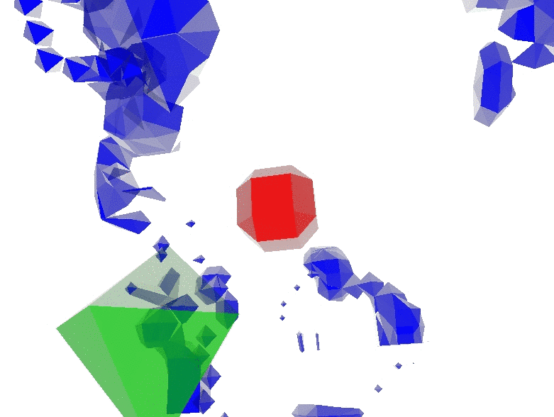
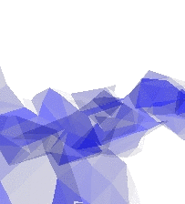

GPU-Accelerated 3D Ant Colony Simulation and Visualization
==========================================================

by Dan Andersen (http://www.dan.andersen.name/)

Background
----------

This is the final project I did during my first semester of graduate school, for Purdue University's Fall 2014 CS535 (Interactive Computer Graphics) course: https://www.cs.purdue.edu/homes/aliaga/cs535-14/index.htm

Ant colony optimization algorithms are useful for pathfinding, such as in robotics and distributed networks. In this simulated scenario, a collection of ants can converge on common solutions to finding nearby food, despite each ant only having knowledge of its immediate surroundings. This particular quality makes ant colony simulation suitable for parallelization and GPGPU.

The basic setup of the simulation is that ants wander randomly from a central nest point, laying a pheromone trail behind them. They pick up food when they encounter it and return it to the nest. Other ants will follow existing trails, strengthening them over time.

How to Use
----------

An executable is available in "EXE/myproject.exe". Note that the associated DLL and GLSL files must be in the same directory as the EXE.

C++ source code is available in a VS2010 project in the "Source Code" directory.

Simulation
----------

The world is simulated using a pair of ping-ponged 3D textures (of size N x N x N). The world state for each cell is encoded in the RGBA values of each pixel: red means there is a nest in the cell, the green level shows how much food remains at the cell, the blue level shows the pheromone trail strength, and alpha is used to mark if an ant is currently present in the cell.

The world simulation is done with a fragment shader that increases the pheromone trail if an ant is in the cell, and otherwise fades the pheromone trail over time.

Simulation of ants is done with a separate pair of 2D textures (of size M x 1). Each pixel represents an ant. The RGB value represents the ant's XYZ position in the world, and the alpha channel uses bitmasks to encode information about the direction the ant is facing, and whether or not the ant is carrying any food.

The fragment shader that simulates ant behavior does texture lookups on the current world texture to find valid and desired movement locations in a cone in front of the ant. Depending on whether the ant is at food or the nest, it will pick up or drop off food. If there is a trail in front of the ant, the ant will move to the cell in front of it with the strongest trail (though there is an option for the ant to move randomly instead, thus preventing the ant from getting stuck in loops of its own trail).

Visualization
-------------

The volume is rendered using a geometry shader, taking as input a single vertex at each grid point, and outputting a set of triangles for a volumetric mesh near that point. It uses the marching cubes algorithm, which evaluates the trail/nest/food/ant value at a point and at 8 surrounding points, does a lookup of 256 possible triangle configurations, and uses linear interpolation to determine vertex locations.

Results
-------

Swarm behavior of ants is sensitive to variation in ant path-finding algorithm: ants can get stuck in their own trail -- though this can also happen in the real world (e.g. ant mills).

The simulation runs easily at real-time rates at a world size of 128 x 128 x 128.

